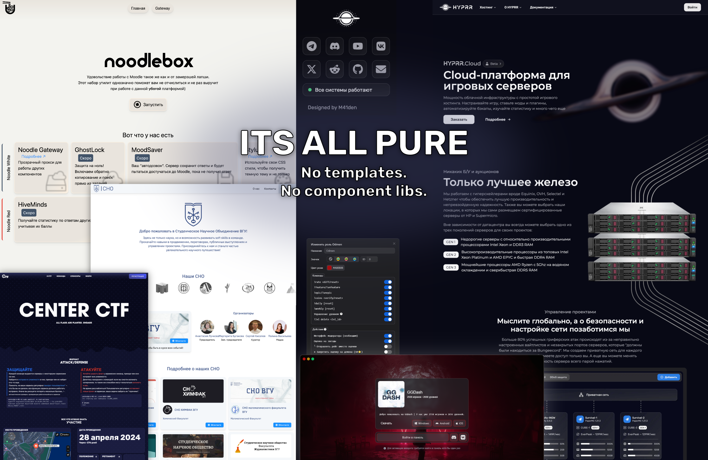

# Welcome to the Insanity HQ!

My name is Alexander, also known as [M41den](https://m41den.dev), and I will be your host for today.

I'm a Full Stack developer and a Computer Science student at [Voronezh State University](https://vsu.ru/).

If you want to DM me, all my contacts can be found on [m41den.dev](https://m41den.dev). 
Yes, I can create a website for your business needs (incl. figuring out your brand identity, style, color palette, etc.)

## ✨ Frontend Development

My primary skill and my delight. 
From one-page landings to complex UIs — it can be done right.

And most importantly, it's not just Figma mockups. Check these out:

* [HYPRR](https://hyprr.space/) - My flagship project, the first gaming cloud platform of its kind.
* [CenterCTF](https://centerctf.ru/) - [[GitHub]](https://github.com/pr1nceio/centerctf.ru) - Landing page for local CTF, my first time playing with GSAP
* [FruitSpace](https://fruitspace.ru/) - [[GitHub]](https://github.com/pr1nceio/fruitspace.ru) - My previous project. TOP-1 GDPS hosting in Russian-speaking countries.
* SSA CSF - [[GitHub]](https://github.com/pr1nceio/ssa-csf) - Website for our university science student association
* DronePost - [[GitHub]](https://github.com/pr1nceio/drone-frontend) - That time when a big company decided to outsource their work to students for free via hackathon.

## ⚡ Backend Development

It'll be a bang as long as it's written in Golang.

Check these projects out:

- Particle Engine - [[GitHub]](https://github.com/pr1nceio/particle-engine) - Basically Docker for poor people.
- GDPS GhostCore - [[GitHub]](https://github.com/pr1nceio/GDPSGhostCore) - Highly optimized core for private Geometry Dash servers.
- FruitSpace API - [[Github]](https://github.com/pr1nceio/FiberAPI) - everything I know about Golang in one place
